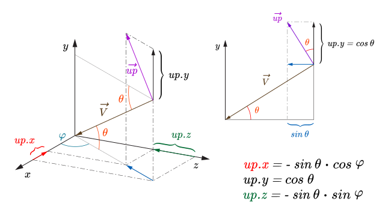

# Toggle: 

# Tool for Generically Visualize and Debug 3D Scenes in OpenGL

This document gives the conventions, the theoretic basis, as well as the implementation details for a generic demo to visualize a 3D scene interactively by using mouse or keyboard arrows and other keyboard keys to move the observer around the object, approach the object, go farther away from the object, etc. This is an old program I wrote in C for Silicon Graphics GL in the mid-90's, that I previously ported to OpenGL, and that is now revamped to be shared as an open source software. 

At the time I used gluLookAt to define the camera, and GLUT for user interaction using the keyboard. This is the reason why we need an $\vec{up}$ vector, since it's one of the arguments of gluLookAt function. GLUT doesn't exist anymore. I substituted it with freeGLUT. This program can be easily ported to other more modern thin libraries that allow to open a window and user interactivity in a portable way, such as GLFW with Glad. 

The $\vec{up}$ vector (that should be rather noted as $\hat{up}$, since it's unitary) just corresponds to the $y$ axis of the camera, whereas the unitary viewing vector $\hat{v}$ (which points to the target from the observer's position) is the $z$ axis of the camera. We obtain the $x$ axis of the camera by calculating $\hat{v}\times\hat{up}$. With these three vectors one can construct a matrix to convert from the 3D scene to the camera space. With this matrix one doesn't need to use gluLookAt, but we simply apply the matrix before showing the 3D scene in OpenGL.

In this program I continue to use gluLookAt for simplicity, since it's easier to understand and use.

In C language the observer position ($obs$) is represented by its coordinates and $\vec{up}$ vector by its components using a struct called $Point$:

``` C
typedef struct {
  double x, y, z;
} Point;

static Point obs;
static Point up;
```

 In this way, one can access the coordinates/components in this way: $obs.x$, $obs.y$, $obs.z$, $up.x$, $up.y$, $up.z$. Geometrically, this corresponds to the reality since points can be represented by position vectors and vectors can be represented by their components as they were points coordinates.

# Conventions and theoretical basis

We show the configuration of $\vec{up}$ (violet colored, identical to $\hat{up}$) and $\vec{V}$ (dark brown colored, where $\hat{v} = \vec{V}/|\vec{V}|$) in the figure below. The coordinate system and the angles $\varphi$ and $\theta$ are also defined here. By convention, $\varphi$ is the angle formed by the projection of a point's position vector onto the XZ plane and the $x$ axis. Also by convention,  $\theta$  is the elevation angle between this position vector and the XZ plane. 



The coordinate system on the left in the figure is just the 3D scene coordinate system translated to the center of the object ($c_x$, $c_y$, $c_z$) for clarity. Thus, we can say that in the case of this drawing $c_x=0$, $c_y=0$, $c_z =0$. Notice that this is just for simplification, since in the case of the demo program *cube*, $c_x=0.5$, $c_y=0.5$, $c_z =0.5$.  The observer is positioned at ($obs_x$, $obs_y$, $obs_z$) and looking at  ($c_x$, $c_y$, $c_z$), which in the figure is the origin of the coordinate system. The observer is not explicitly shown in the figure, but is implicitly located at the point where vectors $\vec{V}$ and $\vec{up}$ are applied. We formally define $\vec{V}$ in this way:

```math
\begin{eqnarray}
\vec{V} = (obs_x - c_x)\ \vec{i} + (obs_y - c_y)\ \vec{j} + (obs_z - c_z)\ \vec{k}
\end{eqnarray}
```
We now formally define vector $\hat{v}$,  which has the same direction as $\vec{V}$, but it's normalized:
```math
\begin{array}{lllll} 
	\hspace{1mm}{\hat{v}} & = & {\displaystyle\frac{\vec{V}}{|\vec{V}|}} & \\[3pt]
	\hspace{1mm}{\hat{v}} & = & {\displaystyle\frac{\vec{V}}{\displaystyle\sqrt{(obs_x - c_x)^2 + (obs_y - c_y)^2 + (obs_z - c_z)^2}}}
\end{array}
```

to be continued ...
